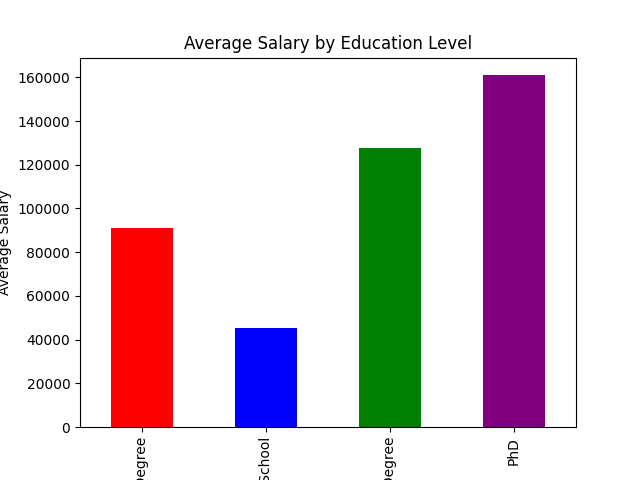
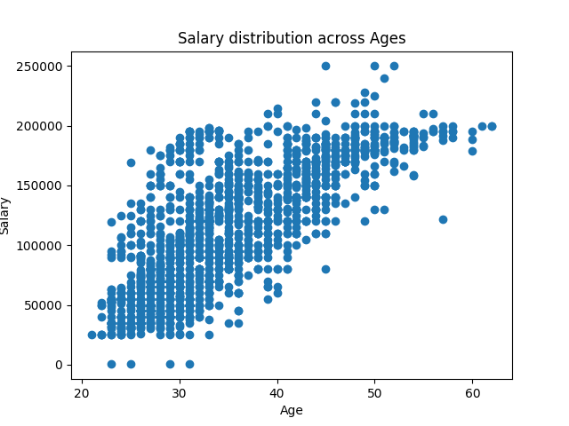
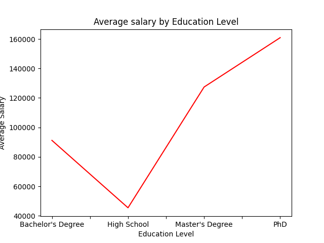

# **EMPLOYEES SALARY DATA ANALYSIS**

## PROJECT OVERVIEW
Exploratory Data Analysis (EDA) on an employee salary dataset to uncover key compensation drivers and demographic trends. This project utilizes **Pandas** for data manipulation and **Matplotlib** for visualizations, performed using **Python**.

## DATASET
**Source**: Kaggle - [https://www.kaggle.com/datasets/mohithsairamreddy/salary-data,]

**Variables Analyzed**:'Age', 'Gender', 'Education Level',	'Job Title', 'Years of Experience', 'Salary'

**Notebook**: [https://colab.research.google.com/drive/1qIGnICkrgF4eRFLRL__qqeFITS2BMyjH?usp=sharing]

## KEY FINDINGS
The analysis identified three primary factors influencing employee compensation:

1. Education Level is the Strongest Predictor: A strong, linear relationship was found between education level and average salary. Getting a higher degree is the biggest factor in earning more money. People with a PhD (the highest degree) or a Master's degree consistently earn much more than others. This shows that companies pay a lot extra for highly specialized knowledge.

2. Job Title and Leadership Drive Top Earnings: The best-paying jobs are held by Executive Leaders (like CEO and CTO) and people in advanced Data Science roles. This highlights the high value placed on company managers and employees with advanced technical skills.
   
3. Salary Dispersion Increases with Age: While salary generally increases with age and experience, the range widens dramatically after age 40. At this stage, specific job roles and performance become more important for reaching the highest salaries than just how many years you've worked.
   
4. Gender Pay Disparity: The data shows that Men earn a higher average salary than Women. This pay gap needs to be investigated further to determine if this is an uncontrolled gap (due to career choice) or controlled pay disparity.

## TECHNOLOGIES USED
- Python

- Pandas

- Matplotlib

- Google Colab

## PROJECT VISUALS
### 1. Education Level vs. Salary (Bar Chart)

*Insight: This chart demonstrates the sharp increase in salary with advanced degrees.*

### 2. Salary Progression with Age

### 3. Gender vs. Salary

*Insight: Men earn a higher average salary than Women across the dataset. The pay gap is evident, with the average salary for the Male group being visibly higher than the Female group. Further analysis is needed to determine the root cause*

### Education Level vs. Salary (Line Chart)

*Insight: There is a clear, direct, and positive relationship between education and compensation. The line shows a steady, upward trend: as the level of education increases (from High School up to PhD), the average salary increases significantly. The biggest salary jumps occur after attaining a Master's Degree and a PhD.*

*Insight: Salary dispersion is much wider for employees over 40.*

### Top 5 Jobs

*Insights: The highest-paying jobs are dominated by executive and specialized technical roles. Executive Leaders (like CEO and CTO) and advanced Data Science roles consistently have the highest average salaries in the dataset. This shows that the market places the highest value on both company management and highly specialized, cutting-edge technical expertise.*

## CONTACT ME
Explore my portfolio to see how I keep the details in check and businesses on track [https://gloriaaustinportfolio.my.canva.site/]

LinkedIn	[www.linkedin.com/in/gloria-austin-143334292]

Email	[gloriaaustin002@gmail.com]

Phone [+234 9016593496]
